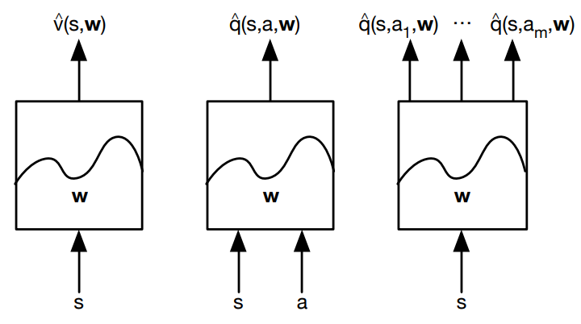
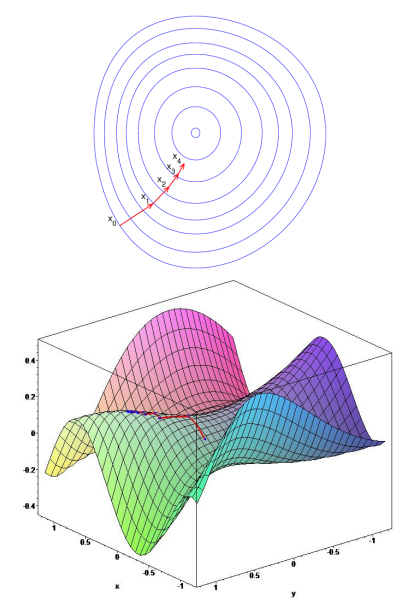
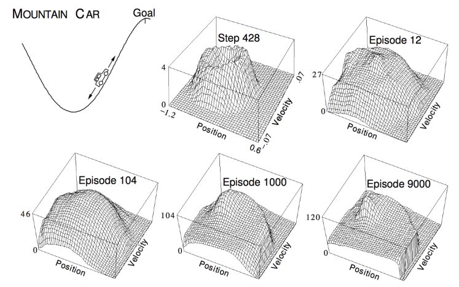
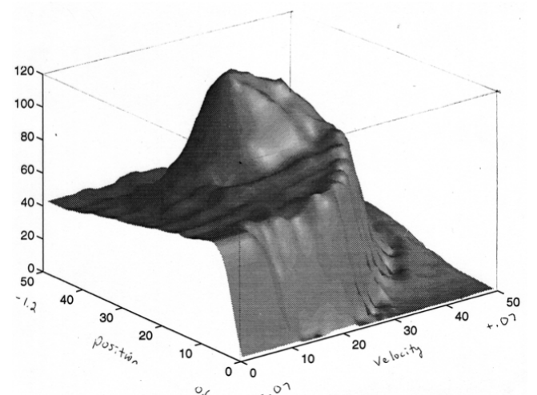
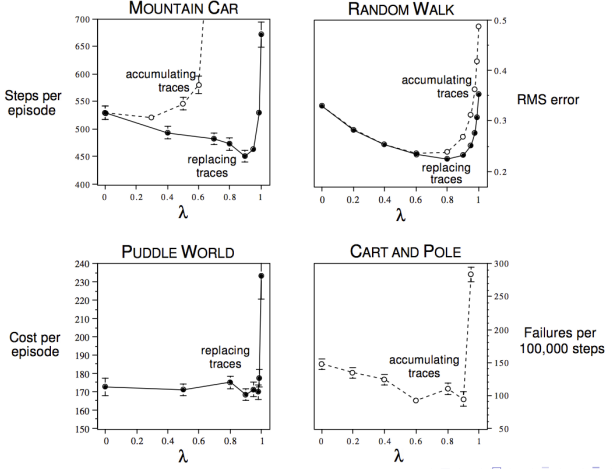

# 第六讲 价值函数的近似法(Value Function Approximation)

## 前言

前面第一部分（前五讲）主要介绍强化学习的基础理论和强化学习算法的核心思想，这些算法的价值函数用表格来存储，因此也称为表格解方法（Tabular Solution methods）。虽然这些算法可以得到准确的解，但是这些算法只能求解规模比较小的问题。因此，在接下来的第二部分，将聚焦于各种价值函数、策略函数的近似表示；用于求解大规模问题，这部分称为近似解方法（Approximation solution methods）。

在很多实际任务中，几乎遇到的每一状态在之前都是没见过的。在这样的状态下做出合理的决策，需要能从之前遇到的且与当前这个状态一定程度上相似的不同状态的经历中总结出来这个合理的决策。换句话说，泛化（generalization）才是最关键的问题。幸运的是，从例子中泛化的方法已经被广泛研究。我们只需要将强化学习与现有的泛化方法相结合。我们所需要的泛化类型通常被称为函数近似（function approximation），因为它从目标函数（例如，值函数）中获取例子，然后尝试从这些例子中泛化到构建一个对整个函数的近似。函数近似是监督学习的一个实例，也是机器学习、人工神经网络、模式识别、统计曲线拟合的主要研究问题。

在本讲中先介绍价值函数的近似表示和学习。下一讲介绍策略的近似表示和学习。在实际应用中，对于大规模问题，状态和行为空间都比较大的情况下，精确获得各种价值函数v(S)和q(s,a)几乎是不可能的。这时候需要找到近似的函数，具体可以使用线性组合、神经网络以及其他方法来近似价值函数。本讲的新颖性在于近似函数不是表示成表格，而是表示成带有权重向量w的参数化函数形式，

$$
\hat{v}(s,w) \approx v_{\pi}(s) 
$$

上式表示状态s给定权重向量时的近似值。如 $\hat{v}$ 可能是状态的特征的线性函数，w 为特征权重向量。更一般地，$\hat{v}$ 可能是多层人工神经网络计算的函数，w为在所有层中的连接权重向量。

通过函数近似，可以用少量的参数w来拟合实际的各种价值函数。本讲同时在理论上比较了各种近似方法的优缺点以及是否收敛于最优解等。本讲将各种近似方法分为两大类，一类是“增量方法”，针对每一步，近似函数得到一些信息，立即优化近似函数，主要用于在线学习；另一类是“批方法”，针对一批历史数据集中进行近似。两类方法没有明显的界限，相互借鉴。

## 6.1 简介

**大规模强化学习(Large-Scale Reinforcement Learning)**

大规模强化学习指用强化学习来解决大规模的问题。如下围棋有 $10^{170}$ 个状态空间。我们该如何才能将前面两讲中的无模型预测和控制的方法规模扩大化呢？

**近似价值函数(Value Function Approximation)**

到目前为止，我们使用查表（Table Lookup）的方式来表示价值函数，因此，每一个状态或者每一个状态行为对与表格中的一个V或Q值的条目对应。对于大规模问题，有太多的状态或动作需要存储在内存中，而且对于每一个状态单独地学习得到价值也是一个很慢的过程。

大规模问题的解决方法是，
1. 用函数近似来估计价值函数：

$$
\hat{v}(s,w) \approx v_{\pi}(s)\\
\hat{q}(s,a,w) \approx q_{\pi}(s,a)  
$$

2. 从经历过的状态泛化到未经历的状态
3. 使用MC或TD学习来更行参数w

**近似函数的类型(Types of Value Function Approximation)**

对于强化学习，根据输入和输出的不同，近似函数分为三类，如图，

1. 输入为状态s，输出为状态价值函数的近似
2. 输入为状态动作对s,a，输出为状态动作价值函数的近似
3. 输入为状态s，输出为该状态下所有可能的动作的动作价值函数的近似

**有哪些近似函数呢？**

有非常多的近似函数，如特征的线性组合（Linear combinations of features），神经网络，决策树，最邻近法等等。所有和机器学习相关的一些算法都可以应用到强化学习中来，但是我们主要考虑可求导(differentiable)的近似函数，如**线性回归和神经网络**在强化学习里应用得比较广泛。

强化学习应用的场景其数据通常是非静态(non-stationary)、非独立同分布(non-iid)的，因为一个状态数据可能是持续流入的，而且下一个状态通常与前一个状态是高度相关的。因此，我们需要近似函数的方法能够处理非静态、非独立同分布的数据。

接下来将分别从增量方法和批方法两个角度来讲解价值函数的近似方法，其主要思想都是梯度下降，与机器学习中的随机梯度下降和批梯度下降相对应。

## 6.2 增量方法(Incremental Methods)

首先回顾一下梯度、梯度下降及其应用。

### 6.2.1 梯度下降(Gradient Descent)

设J(w)是一个关于参数向量w的可导（可微）函数，定义J(w)的梯度如下：

$$
\nabla_{w} J(w)= \begin{pmatrix} \frac{\partial J(w)}{\partial w_{1}} \\ \vdots \\ \frac{\partial J(w)}{\partial w_{n}} \\ \end{pmatrix}
$$

为了寻找J(w)的局部最小值,朝着负梯度的方向更新梯度向量w,

$$
\Delta w = -\frac{1}{2}\alpha \nabla_{w} J(w)
$$

其中，$\alpha$ 是步长参数，机器学习里称为学习速率。

梯度的示意图如下，

**用随机梯度下降来求函数的近似**

* 找到参数向量w,使得近似函数 $\hat{v}(s,w)$  与实际函数 $ v_{\pi}(s)$ 的均方差最小：

$$
J(w) = \mathbb E_{\pi}[（v_{\pi}(S)-\hat{v}(S,w))^{2}] 
$$

* 用梯度下降找到局部最小值：
  
$$\begin {aligned}
\Delta w &= -\frac{1}{2}\alpha \nabla_{w} J(w)\\
&= \alpha \mathbb E_{\pi}[(v_{\pi}(S)-\hat{v}(S,w))\nabla_{w}\hat{v}(S,w)]
\end {aligned}
$$

* 随机梯度下降算法会对梯度进行采样：

$$
\Delta w = \alpha (v_{\pi}(S)-\hat{v}(S,w))\nabla_{w}\hat{v}(S,w)
$$

* 期望更新等于全梯度（full gradient）下降更新

### 6.2.2 线性函数近似(Linear Function Approximation)

**特征向量**

用一个特征向量表示一个状态，

$$
x(S)= \begin{pmatrix} x_{1}(S) \\ x_{2}(S)\\\vdots \\ x_{n}(S) \\ \end{pmatrix}
$$

其中，x(S)分量 $x_{i}(S)$ 是函数 $x_{i} :\mathbb S \rightarrow \mathbb R $ 的值。我们称 $x_{i}(S)$ 是状态S的一个特征。如，股市的趋势、机器人离路标的距离都可以用一个特征向量表示。

可以把价值函数表示成特征的线性组合：

$$
\hat{v}(S,w) = x(S)^{T}w = \sum_{j=1}^{n}x_{j}(S) w_{j}
$$

这样，目标函数是w的二次形式：

$$
J(w) = \mathbb E_{\pi}\left[\left(v_{\pi}(S)-x(S)^{T}w \right)^{2}\right] 
$$

使用随机梯度下降可以收敛至全局最优解。参数更新规则比较简单：
$$
\nabla_{w}\hat{v}(S,w) = x(S)\\
\Delta w=\alpha \left( v_{\pi}(S)-\hat{v}(S,w)\right) x(S)
$$

即，参数更新 = 步长 x 预测误差 x 特征值

**查表法特征(Table Lookup Features)**
查表方法是线性价值函数近似方法的一个特殊情况。每一个状态看成一个特征，个体具体处在某一个状态时，该状态特征取1，其余取0。参数的数目就是状态数，也就是每一个状态特征有一个参数。使用表格查找特性，

$$
x^{table}(S)= \begin{pmatrix} 1(S = s_{1}) \\ 1(S=s_{2})\\\vdots \\ 1(S=s_{n}) \\ \end{pmatrix}
$$

参数向量w本质上相当于给了每个状态对应的值函数

$$
\hat{v}(S,w) =\begin{pmatrix} 1(S = s_{1}) \\ 1(S=s_{2})\\\vdots \\ 1(S=s_{n}) \\ \end{pmatrix} . \begin{pmatrix} w_{1} \\ w_{2}\\\vdots \\ w_{n} \\ \end{pmatrix} 
$$

### 6.2.3 增量预测算法(Incremental Prediction Algorithms)

之前的公式假设给定了真实的值函数 $v_{\pi}(s)$ 。但是，强化学习里只有即时奖励，没有监督数据。
我们要找到能替代 $v_{\pi}(s)$ 的目标值，以便使用监督学习的算法学习到近似函数的参数。
对于MC算法，目标值就是回报 $G_{t}$ :
$$
\Delta w=\alpha \left( G_{t}-\hat{v}(S,w)\right) \nabla_{w}\hat{v}(S,w)
$$

对于TD(0)，目标值就是TD目标：
$$
\Delta w=\alpha \left( R_{t+1}+\gamma \hat{v}(S_{t+1},w) -\hat{v}(S,w) \right) \nabla_{w}\hat{v}(S,w)
$$

对于TD(λ)，目标值是λ回报：

$$
\Delta w=\alpha \left( G_{t}^{\lambda}-\hat{v}(S,w)\right) \nabla_{w}\hat{v}(S,w)
$$

**用价值函数近似的MC(MC with Value Function Approximation)**

收获 $G_{t}$ 是真实价值 $v_{\pi}(S_{t})$ 的有噪声、无偏采样，因此，可以把监督学习应用于“训练数据集”：

$$
<S_{1},G_{1}>,<S_{2},G_{2}>,\dots,<S_{T},G_{T}>
$$

例如，用线性MC策略评估：

$$\begin {aligned}
\Delta w &=\alpha \left( G_{t}-\hat{v}(S,w)\right) \nabla_{w}\hat{v}(S,w)\\
&=\alpha \left( G_{t}-\hat{v}(S,w)\right) x(S_{t})
\end {aligned}
$$

蒙特卡洛策略迭代即使使用非线性价值函数近似时，也可以收敛至一个局部最优解。

**用价值函数近似的TD(TD Learning with Value Function Approximation)**

TD目标 $R_{t+1} +\gamma \hat{v}(S_{t+1},w)$ 是真实价值 $v_{\pi}(S_{t})$ 的有偏采样, 仍然可以把监督学习应用于“训练数据集”：

$$
<S_{1},R_{2} +\gamma \hat{v}(S_{2},w)>,<S_{2},R_{3} +\gamma \hat{v}(S_{3},w)>,\dots,<S_{T-1},R_{T} >
$$

例如，用线性TD(0):

$$\begin {aligned}
\Delta w &=\alpha \left( R+ \gamma \hat{v}(S',w)- \hat{v}(S,w) \right) \nabla_{w}\hat{v}(S,w)\\
&=\alpha \delta x(S)
\end {aligned}
$$

线性TD(0)收敛于(逼近)全局最优

**用价值函数近似的TD(λ) (TD(λ) Learning with Value Function Approximation)**

λ回报 $G_{t}^{\lambda}$ 也是真实价值 $v_{\pi}(S_{t})$ 的有偏采样, 可以把监督学习应用于“训练数据集”：

$$
<S_{1},G_{1}^{\lambda}>,<S_{2},G_{2}^{\lambda}>,\dots,<S_{T-1},G_{T-1}^{\lambda} >
$$

前向视角线性TD(λ)：

$$\begin {aligned}
\Delta w &=\alpha \left(G_{t}^{\lambda} - \hat{v}(S,w) \right) \nabla_{w}\hat{v}(S,w)\\
&=\alpha \left( G_{t}^{\lambda}-\hat{v}(S,w)\right) x(S_{t})
\end {aligned}
$$

反向视角线性TD(λ)：

$$\begin {aligned}
\delta_{t} &=R_{t+1} +\gamma \hat{v}(S_{t+1},w) -\hat{v}(S_{t},w)\\
E_{t} &= \gamma \lambda E_{t-1} + x(S_{t})\\
\nabla_{w} &= \alpha \delta_{t}E_{t}
\end {aligned}
$$

前向视角和反向视角线性TD(λ)是等价的。

**用价值函数近似的控制 (Control with Value Function Approximation)**

如何把近似函数引入到控制过程中呢？我们需要能够近似状态行为对的价值函数近似而不是仅针对状态的价值函数近似。

从参数w开始，得到一个近似的状态行为对价值函数，在Ɛ-greedy执行策略下产生一个行为，执行该行为得到一个即时奖励，以此数据计算目标值，进行近似函数参数的更新。再应用这个策略得到后续的状态和对应的目标值，每经历一次状态就更新依次参数，如此反复进行策略的优化，同时逼近最优价值函数。

策略评估：是一个近似策略评估 $\hat q(.,.,w) \approx q_{\pi}$ ，特别是早期误差会较大，而且这种近似无法最终收敛于最优策略对应的动作价值函数，只能在其周围震荡，后文将讲述改进方法。

策略改善：使用Ɛ-greedy执行。

**动作价值函数近似(Action-Value Function Approximation)**

动作价值函数近似表示为：
$$
\hat q(S,A,w) \approx q_{\pi}(S,A)
$$

近似动作函数fn \hat q(S,A,w)与真实动作价值fn q_{\pi}(S,A) 的最小均方误差：
$$
J(w) = \mathbb E_{\pi}[(q_{\pi}(S,A)-\hat q(S,A,w))^{2}]
$$

使用随机梯度下降来寻找局部最优解：
$$\begin {aligned}
-\frac{1}{2} \nabla_{w}J(w) &= (q_{\pi}(S,A)-\hat q(S,A,w)) \nabla_{w}\hat q(S,A,w)\\ \nabla_{w} &= \alpha (q_{\pi}(S,A)-\hat q(S,A,w)) \nabla_{w}\hat q(S,A,w)
\end {aligned}
$$

**线性动作价值函数近似(Linear Action-Value Function Approximation)**

把状态和动作表示为一个特征向量：

$$
x(S,A) = \begin {pmatrix} x_{1}(S,A) \\ \dots \\ x_{n}(S,A) \end {pmatrix}
$$

把动作价值函数fn表示为特征的线性组合：
$$
\hat q(S,A,w) =x(S,A)^{T}w=\sum_{j=1}^{n}x_{j}(S,A)w_{j}
$$

随机梯度下降更新：

$$\begin {aligned}
\nabla_{w}\hat q(S,A,w) &=x(S,A)\\
\Delta w &= \alpha (q_{\pi}(S,A)-\hat q(S,A,w))x(S,A)
\end {aligned}
$$

### 6.2.4 增量控制算法(Incremental control Algorithms)

与预测算法类似，我们必须替代真实动作价值的目标值 $q_{\pi}(S,A)$。

对于MC算法，目标值就是回报：
$$
\Delta w=\alpha \left( G_{t}-\hat{q}(S_{t},A_{t},w)\right) \nabla_{w}\hat{q}(S_{t},A_{t},w)
$$

对于TD(0)，目标值就是TD目标：

$$
\Delta w=\alpha \left( R_{t+1}+\gamma \hat{q}(S_{t+1},A_{t+1},w) -\hat{q}(S_{t},A_{t},w) \right) \nabla_{w}\hat{q}(S_{t},A_{t},w)
$$

对于前向认识TD(λ)，目标值是λ回报：

$$
\Delta w=\alpha \left( q_{t}^{\lambda}-\hat{q}(S_{t},A_{t},w) \right) \nabla_{w}\hat{q}(S_{t},A_{t},w)
$$

对于后向认识TD(λ)，对应的参数更新是：
$$\begin {aligned}
\delta_{t} &=R_{t+1} +\gamma \hat{q}(S_{t},A_{t},w) -\hat{q}(S_{t},A_{t},w)\\
E_{t} &= \gamma \lambda E_{t-1} + \nabla_{w}\hat{q}(S_{t},A_{t},w)\\
\nabla_{w} &= \alpha \delta_{t}E_{t}
\end {aligned}
$$

可以看出增量控制算法和增量预测算法非常类似，只是用 $\hat{q}(S_{t},A_{t},w)$ 代替 $\hat{v}(S_{t},w)$

例6-1 粗编码的线性Sarsa在小车爬山例子中(Linear Sarsa with Coarse Coding in Mountain Car) （sutton书例10.1 P244）

小车爬山是一个经典的强化学习示例。环境如上图左上角所示，小车被困于山谷，单靠小车自身的动力是不足以在谷底由静止一次性冲上右侧目标位置的，比较现时的策略是，当小车加速上升到一定位置时，让小车回落，同时反向加速，使其加速冲向谷底，借助势能向动能的转化冲上目标位置。现在问题是在模型位置的情况下，如何用强化学习的方法找到小车冲上目标位置的最优策略。

达到终点前的奖励为-1。有三种可能动作：油门踩到底向前（+1），油门踩到底逆向行驶（-1），不踩油门（0）。到达左边界时，速度重置为0，到达右边界，回合结束。

状态空间是小车的位置和速度，是连续的，通过瓦片编码（tile coding）转化为二值特征。其它几张三维图展示的是经过不同步数（上中图）以及不同Episode（其余几张三维图）的学习，小车位于某个位置同时具有某个速度的状态价值。

最后小车使用 用径向基函数（Radial Basis Functions）的线性SARSA学习到了接近最优策略的价值函数，如下图：

**研究λ——我们需要Bootstrap吗**

下图显示了几种不同的任务，使用不同λ进行的强化学习算法分析结果。总的来说λ=1的时候通常算法表现是很差的，TD(0)是比MC好得多的方法，这说明了Bootstrap的重要性；不同的任务对应的最优λ值是不太容易确定的。

### 6.2.5 收敛性(Convergence)

****

$$\begin {aligned}

\end {aligned}
$$

$v_{\pi}(s)$

$$$$

## 6.3 批方法(Batch Methods)

### 6.3.1 最小二乘预测(Least square prediction)

****

$$\begin {aligned}

\end {aligned}
$$

$v_{\pi}(s)$

$$$$

### 6.3.2 最小二乘控制(Least square control)

小结：
本节先讲解了引入价值函数的近似表示的重要性，接着从梯度开始讲起，使用梯度下降可以找到一个目标函数的极小值，以此设计一个目标函数来寻找近似价值函数的参数。有机器学习基础的读者理解本节会非常容易。本节的理论重点在于理解不同强化学习方法在应用不同类型的近似函数时的收敛性，能否获得全局最优解，以及DQN算法的设计思想及算法流程。本讲罗列了大量的数学公式，并以线性近似函数为例给出了具体的参数更新办法，这些公式在强大的机器学习库面前已经显得有些过时了，但对于理解一些理论还是有些帮助的。此外，在本讲的最后还简单介绍了不需要迭代更新直接求解线性近似函数参数的方法，可以作为补充了解。一个令人吃惊地结论是，所有函数近似的理论结果同样可以用于部分观测的情况。因为，参数化函数形式不能从状态的某些方面来估计，这就像状态的这些方面不可观测。

参考
1.David Silver第6课
2.Richard Sutton 《Reinforcement Learning  A Introduction》
3.叶强《David Silver强化学习公开课中文讲解及实践》第六讲
4.

